# Relatório Completo — Apartamentos para Aluguel em Porto Alegre

**Data:** 16/03/2025  
**Fontes:** Auxiliadora Predial (21 imóveis)  
**Bairros:** Centro Histórico, Menino Deus, Rio Branco, Cidade Baixa, Farroupilha

---

## 1. Síntese executiva

O levantamento reuniu **21 imóveis** para aluguel em regiões centrais de Porto Alegre. A faixa de aluguel vai de **R$ 1.690** a **R$ 2.600**, com totais mensais entre **R$ 2.080** e **R$ 3.590**.

| Indicador | Valor |
|-----------|-------|
| Faixa de aluguel | R$ 1.690 — R$ 2.600 |
| Faixa total mensal | R$ 2.080 — R$ 3.590 |
| Menor custo mensal | 233858 — R$ 2.120 (69 m², 2 quartos) |
| Maior área | 414697 — 180 m² (3 quartos, R$ 3.427) |
| Imóveis mobiliados/semi | 8 |
| Imóveis com vaga | 4 |
| Imóveis com suíte | 2 |

**Bairros presentes:** Centro Histórico (11), Menino Deus (7), Cidade Baixa (2), Rio Branco (2), Farroupilha (1).

---

## 2. Ranking — Ordenado pelos mais legais

Critérios: custo-benefício, área útil, amenities (mobiliado, suíte, vaga), condomínio e localização.

| # | Ref | Bairro | Total/mês | Área | Q/B | Destaques | Score |
|---|-----|--------|-----------|------|-----|-----------|-------|
| 1 | 778979 | Cidade Baixa | R$ 2.826 | 80 m² | 3/1 | Promoção R$ 800/3 meses, Redenção, portaria 24h | 95 |
| 2 | 288435 | Rio Branco | R$ 2.201 | 90 m² | 3/1 | Melhor R$/m² (24), 90m², sacada, condomínio R$ 1 | 94 |
| 3 | 233858 | Centro Histórico | R$ 2.120 | 69 m² | 2/1 | Menor custo total, Zaffari, sol norte | 92 |
| 4 | 713219 | Menino Deus | R$ 2.417 | 60 m² | 3/1 | 3 quartos barato, churrasqueira, Praia de Belas | 90 |
| 5 | 399585 | Centro Histórico | R$ 2.943 | 99 m² | 2/1 | Mobiliado, 99m², split, sacada, Praça da Matriz | 88 |
| 6 | 780137 | Menino Deus | R$ 2.080 | 78 m² | 1/1 | 2º menor total, vaga, sol norte | 87 |
| 7 | 773524 | Rio Branco | R$ 2.660 | 72 m² | 3/1 | Condomínio R$ 400, 3 quartos | 85 |
| 8 | 778856 | Cidade Baixa | R$ 3.163 | 70 m² | 3/1 | 3 quartos + vaga | 84 |
| 9 | 324467 | Centro Histórico | R$ 2.280 | 68 m² | 1/1 | Semi-mobiliado, churrasqueira, sacada, elevador | 82 |
| 10 | 769207 | Menino Deus | R$ 2.505 | 68 m² | 2/1 | Getúlio Vargas, shoppings, Zaffari | 80 |
| 11 | 301265 | Centro Histórico | R$ 2.760 | 66 m² | 2/1 | Mobiliado, Demétrio Ribeiro, agendamento digital | 78 |
| 12 | 368518 | Menino Deus | R$ 2.673 | 64 m² | 2/1 | Semi-mobiliado, armários, sol oeste | 76 |
| 13 | 235724 | Centro Histórico | R$ 3.063 | 97 m² | 3/1 | 97m², salão festas, churrasqueira, Riachuelo | 75 |
| 14 | 383167 | Centro Histórico | R$ 3.070 | 85 m² | 2/2 | Suíte, vaga, Santa Casa, gás central | 74 |
| 15 | 283896 | Centro Histórico | R$ 3.013 | 77 m² | 2/2 | Suíte, hidromassagem, vista panorâmica | 73 |
| 16 | 482419 | Centro Histórico | R$ 3.110 | 76 m² | 2/1 | Mobiliado completo, Coronel Genuíno | 71 |
| 17 | 774911 | Menino Deus | R$ 3.061 | 80 m² | 2/1 | Ar-condicionado, Parque Marinha, bidê | 69 |
| 18 | 413397 | Menino Deus | R$ 3.062 | 60 m² | 2/1 | Mobiliado, churrasqueira, Orla Guaíba | 67 |
| 19 | 781919 | Menino Deus | R$ 2.650 | 65 m² | 2/2 | 2 banheiros, condomínio R$ 420 | 65 |
| 20 | 414697 | Centro Histórico | R$ 3.427 | 180 m² | 3/1 | Maior área, amplo, semi-mobiliado | 62 |
| 21 | 781392 | Farroupilha | R$ 3.590 | 86 m² | 2/2 | Av. João Pessoa, 2 banheiros (anúncio novo) | 58 |

---

## 3. Detalhamento por imóvel

### 🥇 1º — [778979](https://www.auxiliadorapredial.com.br/imovel/aluguel/778979) | Cidade Baixa

**[🗺️ Ver no Google Maps Street View](https://www.google.com/maps?q=Rua+General+Lima+e+Silva,+Cidade+Baixa,+Porto+Alegre)**

*Sem imagem disponível* · [Ver anúncio](https://www.auxiliadorapredial.com.br/imovel/aluguel/778979)

| Campo | Valor |
|-------|-------|
| Endereço | [Rua General Lima e Silva, Cidade Baixa](https://www.google.com/maps?q=Rua+General+Lima+e+Silva,+Cidade+Baixa,+Porto+Alegre) |
| Aluguel | R$ 1.900 |
| Total | R$ 2.826 |
| Área | 80 m² |
| Quartos/Banheiros | 3 / 1 |
| IPTU | R$ 126 | Condomínio | R$ 800 |
| **Diferencial** | Promoção R$ 800 nos 3 primeiros meses; próximo à Redenção; portaria 24h e elevador |

---

### 🥈 2º — [288435](https://www.auxiliadorapredial.com.br/imovel/aluguel/288435) | Rio Branco

**[🗺️ Ver no Google Maps Street View](https://www.google.com/maps?q=Rua+Cesar+Lombroso,+Rio+Branco,+Porto+Alegre)**

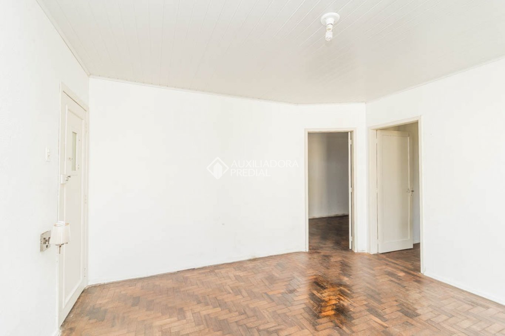 · [Ver anúncio](https://www.auxiliadorapredial.com.br/imovel/aluguel/288435)

| Campo | Valor |
|-------|-------|
| Endereço | [Rua Cesar Lombroso, Rio Branco](https://www.google.com/maps?q=Rua+Cesar+Lombroso,+Rio+Branco,+Porto+Alegre) |
| Aluguel | R$ 2.100 |
| Total | R$ 2.201 |
| Área | 90 m² |
| Quartos/Banheiros | 3 / 1 |
| IPTU | R$ 100 | Condomínio | R$ 1 |
| **Diferencial** | Melhor custo-benefício (R$ 24,45/m²); condomínio simbólico; próximo Auditório Araújo Vianna e Zaffari |

---

### 🥉 3º — [233858](https://www.auxiliadorapredial.com.br/imovel/aluguel/233858) | Centro Histórico

**[🗺️ Ver no Google Maps Street View](https://www.google.com/maps?q=Rua+Duque+de+Caxias,+Centro+Historico,+Porto+Alegre)**

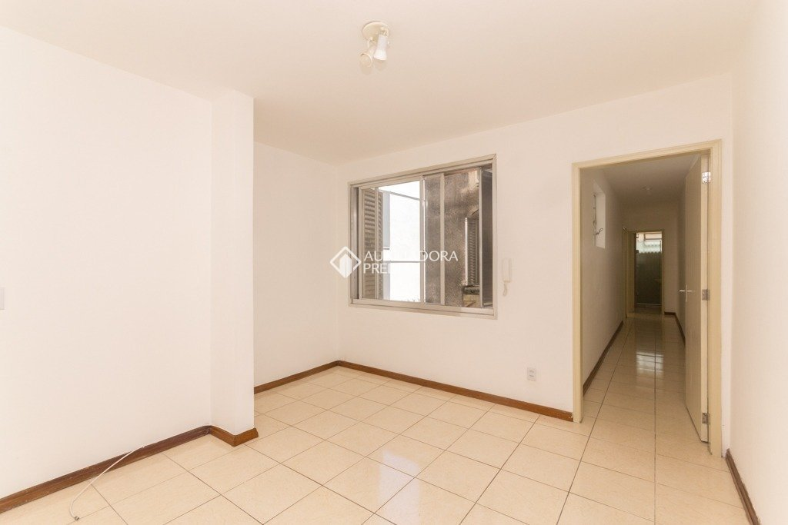 · [Ver anúncio](https://www.auxiliadorapredial.com.br/imovel/aluguel/233858)

| Campo | Valor |
|-------|-------|
| Endereço | [Rua Duque de Caxias, Centro Histórico](https://www.google.com/maps?q=Rua+Duque+de+Caxias,+Centro+Historico,+Porto+Alegre) |
| Aluguel | R$ 1.690 |
| Total | R$ 2.120 |
| Área | 69 m² |
| Quartos/Banheiros | 2 / 1 |
| IPTU | R$ 80 | Condomínio | R$ 350 |
| **Diferencial** | Menor custo total; próximo Zaffari e Cais Embarcadero; posição solar norte; 2º andar |

---

### 4º — [713219](https://www.auxiliadorapredial.com.br/imovel/aluguel/713219) | Menino Deus

**[🗺️ Ver no Google Maps Street View](https://www.google.com/maps?q=Rua+Baronesa+do+Gravatai,+Menino+Deus,+Porto+Alegre)**

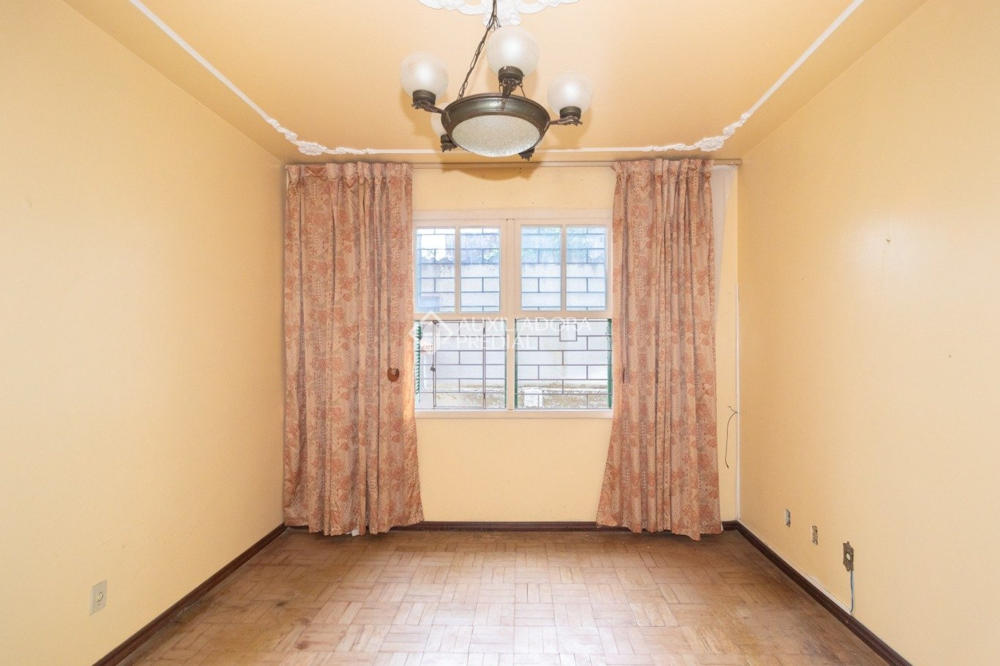 · [Ver anúncio](https://www.auxiliadorapredial.com.br/imovel/aluguel/713219)

| Campo | Valor |
|-------|-------|
| Endereço | [Rua Baronesa do Gravataí, Menino Deus](https://www.google.com/maps?q=Rua+Baronesa+do+Gravatai,+Menino+Deus,+Porto+Alegre) |
| Aluguel | R$ 1.800 |
| Total | R$ 2.417 |
| Área | 60 m² |
| Quartos/Banheiros | 3 / 1 |
| IPTU | R$ 67 | Condomínio | R$ 550 |
| **Diferencial** | 3 quartos por bom preço; semi-mobiliado; pátio com churrasqueira; próximo Praia de Belas |

---

### 5º — [399585](https://www.auxiliadorapredial.com.br/imovel/aluguel/399585) | Centro Histórico

**[🗺️ Ver no Google Maps Street View](https://www.google.com/maps?q=Rua+Jerônimo+Coelho,+Centro+Historico,+Porto+Alegre)**

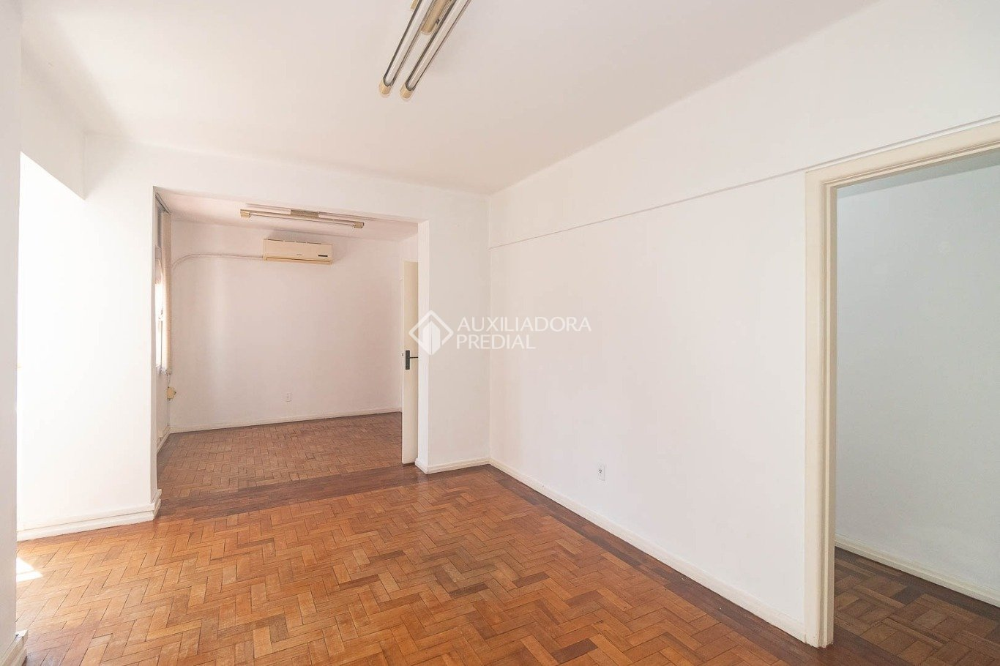 · [Ver anúncio](https://www.auxiliadorapredial.com.br/imovel/aluguel/399585)

| Campo | Valor |
|-------|-------|
| Endereço | [Rua Jerônimo Coelho, Centro Histórico](https://www.google.com/maps?q=Rua+Jerônimo+Coelho,+Centro+Historico,+Porto+Alegre) |
| Aluguel | R$ 1.850 |
| Total | R$ 2.943 |
| Área | 99 m² |
| Quartos/Banheiros | 2 / 1 |
| IPTU | R$ 103 | Condomínio | R$ 990 |
| **Diferencial** | 99 m²; mobiliado; split; dormitório com sacada; banheiro com bidê; elevador |

---

### 6º — [780137](https://www.auxiliadorapredial.com.br/imovel/aluguel/780137) | Menino Deus

**[🗺️ Ver no Google Maps Street View](https://www.google.com/maps?q=Rua+Barao+do+Gravatai,+Menino+Deus,+Porto+Alegre)**

*Sem imagem disponível* · [Ver anúncio](https://www.auxiliadorapredial.com.br/imovel/aluguel/780137)

| Campo | Valor |
|-------|-------|
| Endereço | [Rua Barão do Gravataí, Menino Deus](https://www.google.com/maps?q=Rua+Barao+do+Gravatai,+Menino+Deus,+Porto+Alegre) |
| Aluguel | R$ 1.700 |
| Total | R$ 2.080 |
| Área | 78 m² |
| Quartos/Banheiros/Vagas | 1 / 1 / 1 |
| IPTU | R$ 70 | Condomínio | R$ 310 |
| **Diferencial** | 2º menor total; vaga; posição solar norte; fácil acesso Av. Borges |

---

### 7º — [773524](https://www.auxiliadorapredial.com.br/imovel/aluguel/773524) | Rio Branco

**[🗺️ Ver no Google Maps Street View](https://www.google.com/maps?q=Rua+Cabral,+Rio+Branco,+Porto+Alegre)**

*Sem imagem disponível* · [Ver anúncio](https://www.auxiliadorapredial.com.br/imovel/aluguel/773524)

| Campo | Valor |
|-------|-------|
| Endereço | [Rua Cabral, Rio Branco](https://www.google.com/maps?q=Rua+Cabral,+Rio+Branco,+Porto+Alegre) |
| Aluguel | R$ 2.200 |
| Total | R$ 2.660 |
| Área | 72 m² |
| Quartos/Banheiros | 3 / 1 |
| IPTU | R$ 60 | Condomínio | R$ 400 |
| **Diferencial** | Condomínio baixo; 3 quartos; área total 82 m² |

---

### 8º — [778856](https://www.auxiliadorapredial.com.br/imovel/aluguel/778856) | Cidade Baixa

**[🗺️ Ver no Google Maps Street View](https://www.google.com/maps?q=Travessa+Pesqueiro,+Cidade+Baixa,+Porto+Alegre)**

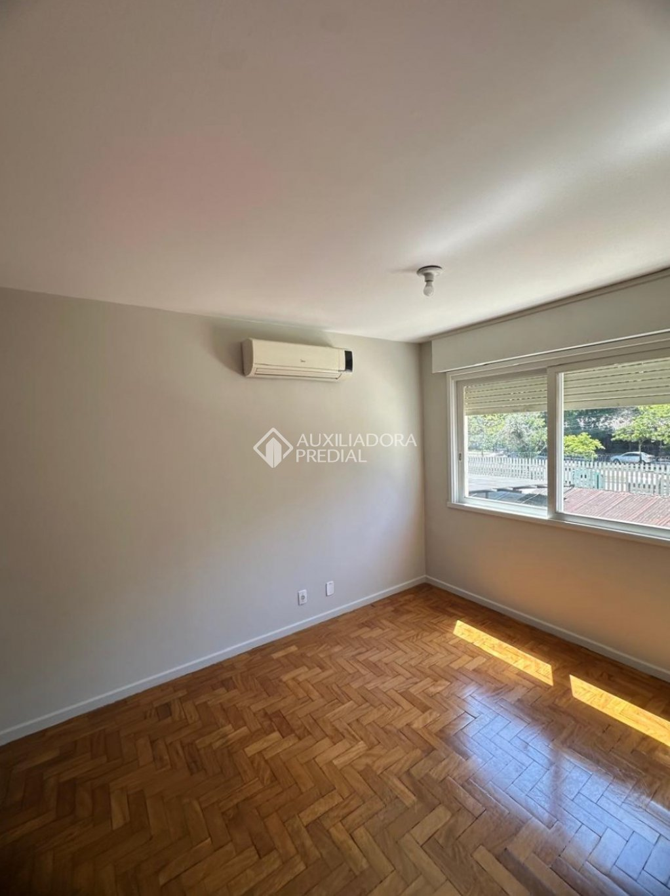 · [Ver anúncio](https://www.auxiliadorapredial.com.br/imovel/aluguel/778856)

| Campo | Valor |
|-------|-------|
| Endereço | [Travessa Pesqueiro, Cidade Baixa](https://www.google.com/maps?q=Travessa+Pesqueiro,+Cidade+Baixa,+Porto+Alegre) |
| Aluguel | R$ 2.500 |
| Total | R$ 3.163 |
| Área | 70 m² |
| Quartos/Banheiros/Vagas | 3 / 1 / 1 |
| IPTU | R$ 113 | Condomínio | R$ 550 |
| **Diferencial** | 3 quartos + vaga; área total 80 m²; localização Cidade Baixa |

---

### 9º — [324467](https://www.auxiliadorapredial.com.br/imovel/aluguel/324467) | Centro Histórico

**[🗺️ Ver no Google Maps Street View](https://www.google.com/maps?q=Rua+Riachuelo,+Centro+Historico,+Porto+Alegre)**

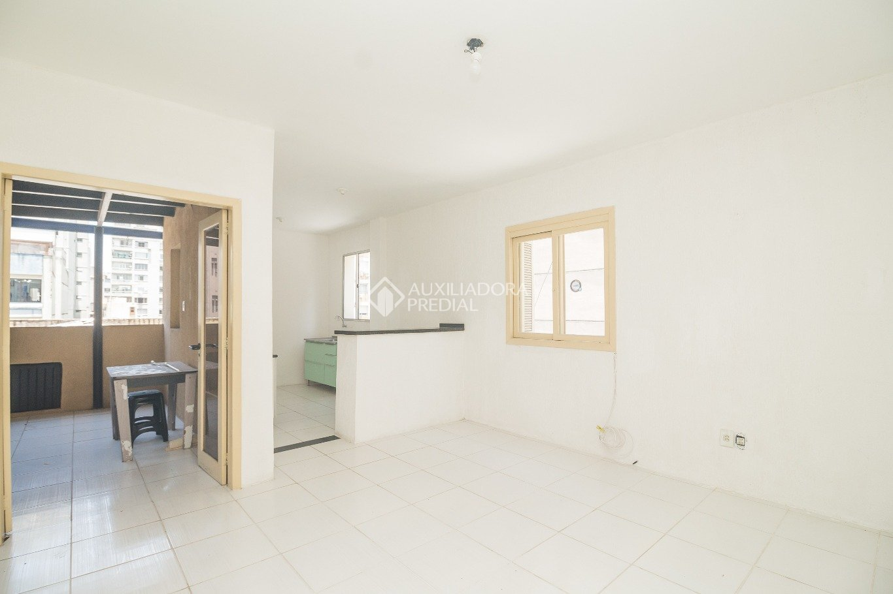 · [Ver anúncio](https://www.auxiliadorapredial.com.br/imovel/aluguel/324467)

| Campo | Valor |
|-------|-------|
| Endereço | [Rua Riachuelo, Centro Histórico](https://www.google.com/maps?q=Rua+Riachuelo,+Centro+Historico,+Porto+Alegre) |
| Aluguel | R$ 1.890 |
| Total | R$ 2.280 |
| Área | 68 m² |
| Quartos/Banheiros | 1 / 1 |
| IPTU | R$ 70 | Condomínio | R$ 320 |
| **Diferencial** | Semi-mobiliado; churrasqueira; sacada; elevador |

---

### 10º — [769207](https://www.auxiliadorapredial.com.br/imovel/aluguel/769207) | Menino Deus

**[🗺️ Ver no Google Maps Street View](https://www.google.com/maps?q=Av+Getulio+Vargas,+Menino+Deus,+Porto+Alegre)**

*Sem imagem disponível* · [Ver anúncio](https://www.auxiliadorapredial.com.br/imovel/aluguel/769207)

| Campo | Valor |
|-------|-------|
| Endereço | [Av. Getúlio Vargas, Menino Deus](https://www.google.com/maps?q=Av+Getulio+Vargas,+Menino+Deus,+Porto+Alegre) |
| Aluguel | R$ 2.000 |
| Total | R$ 2.505 |
| Área | 68 m² |
| Quartos/Banheiros | 2 / 1 |
| IPTU | R$ 65 | Condomínio | R$ 440 |
| **Diferencial** | Boa localização; próximo shoppings, Zaffari, Praça Garibaldi |

---

### 11º — [301265](https://www.auxiliadorapredial.com.br/imovel/aluguel/301265) | Centro Histórico

**[🗺️ Ver no Google Maps Street View](https://www.google.com/maps?q=Rua+Demetrio+Ribeiro,+Centro+Historico,+Porto+Alegre)**

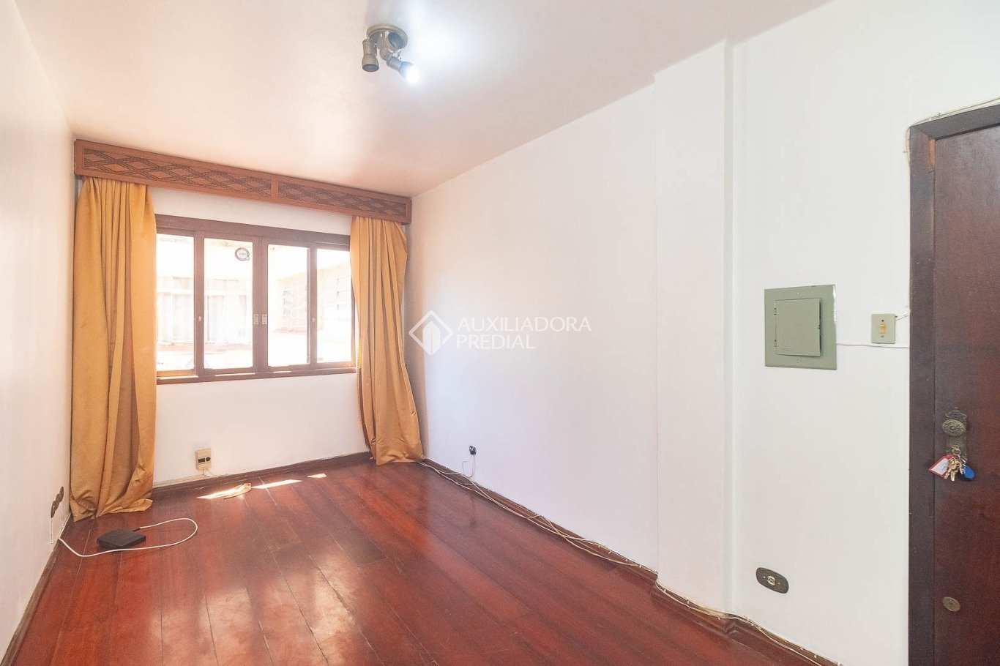 · [Ver anúncio](https://www.auxiliadorapredial.com.br/imovel/aluguel/301265)

| Campo | Valor |
|-------|-------|
| Endereço | [Rua Demétrio Ribeiro, Centro Histórico](https://www.google.com/maps?q=Rua+Demetrio+Ribeiro,+Centro+Historico,+Porto+Alegre) |
| Aluguel | R$ 2.000 |
| Total | R$ 2.760 |
| Área | 66 m² |
| Quartos/Banheiros | 2 / 1 |
| IPTU | R$ 130 | Condomínio | R$ 630 |
| **Diferencial** | Mobiliado; agendamento digital; dependência de empregada |

---

### 12º — [368518](https://www.auxiliadorapredial.com.br/imovel/aluguel/368518) | Menino Deus

**[🗺️ Ver no Google Maps Street View](https://www.google.com/maps?q=Rua+Jose+de+Alencar,+Menino+Deus,+Porto+Alegre)**

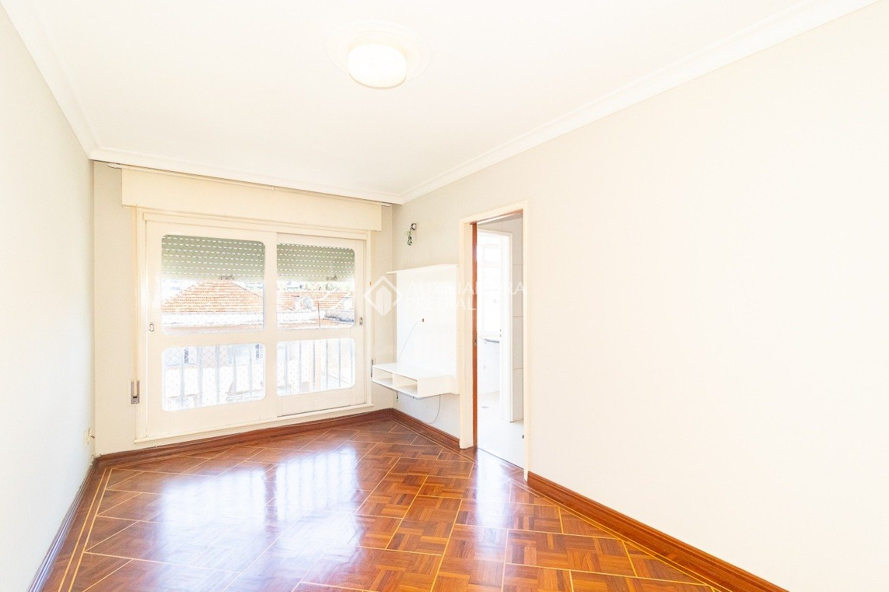 · [Ver anúncio](https://www.auxiliadorapredial.com.br/imovel/aluguel/368518)

| Campo | Valor |
|-------|-------|
| Endereço | [Rua José de Alencar, Menino Deus](https://www.google.com/maps?q=Rua+Jose+de+Alencar,+Menino+Deus,+Porto+Alegre) |
| Aluguel | R$ 2.100 |
| Total | R$ 2.673 |
| Área | 64 m² |
| Quartos/Banheiros | 2 / 1 |
| IPTU | R$ 73 | Condomínio | R$ 500 |
| **Diferencial** | Semi-mobiliado; armários; posição solar oeste; próximo Mãe de Deus |

---

### 13º — [235724](https://www.auxiliadorapredial.com.br/imovel/aluguel/235724) | Centro Histórico

**[🗺️ Ver no Google Maps Street View](https://www.google.com/maps?q=Rua+Riachuelo,+Centro+Historico,+Porto+Alegre)**

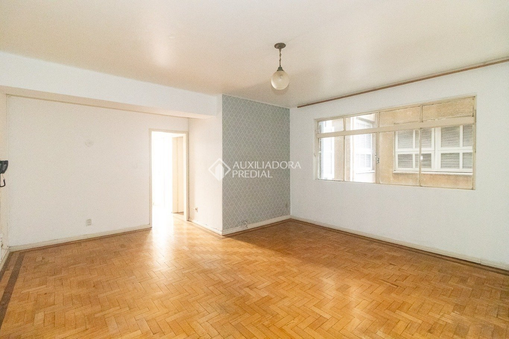 · [Ver anúncio](https://www.auxiliadorapredial.com.br/imovel/aluguel/235724)

| Campo | Valor |
|-------|-------|
| Endereço | [Rua Riachuelo, Centro Histórico](https://www.google.com/maps?q=Rua+Riachuelo,+Centro+Historico,+Porto+Alegre) |
| Aluguel | R$ 2.200 |
| Total | R$ 3.063 |
| Área | 97 m² |
| Quartos/Banheiros | 3 / 1 |
| IPTU | R$ 138 | Condomínio | R$ 725 |
| **Diferencial** | 97 m²; semi-mobiliado; salão de festas; terraço com churrasqueira; elevador |

---

### 14º — [383167](https://www.auxiliadorapredial.com.br/imovel/aluguel/383167) | Centro Histórico

**[🗺️ Ver no Google Maps Street View](https://www.google.com/maps?q=Praca+Raul+Pilla,+Centro+Historico,+Porto+Alegre)**

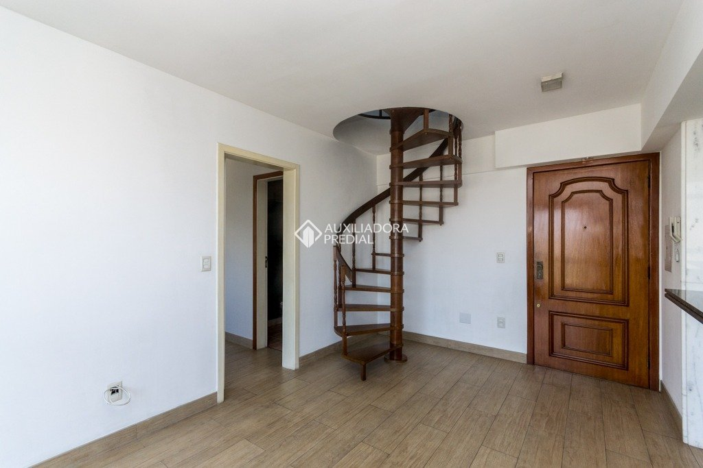 · [Ver anúncio](https://www.auxiliadorapredial.com.br/imovel/aluguel/383167)

| Campo | Valor |
|-------|-------|
| Endereço | [Praça Raul Pilla, Centro Histórico](https://www.google.com/maps?q=Praca+Raul+Pilla,+Centro+Historico,+Porto+Alegre) |
| Aluguel | R$ 2.000 |
| Total | R$ 3.070 |
| Área | 85 m² |
| Quartos/Banheiros/Vagas | 2 / 2 / 1 |
| IPTU | R$ 220 | Condomínio | R$ 850 |
| **Diferencial** | Suíte; vaga; Santa Casa; UFRGS; gás central; salão de festas |

---

### 15º — [283896](https://www.auxiliadorapredial.com.br/imovel/aluguel/283896) | Centro Histórico

**[🗺️ Ver no Google Maps Street View](https://www.google.com/maps?q=Av+Independencia,+Centro+Historico,+Porto+Alegre)**

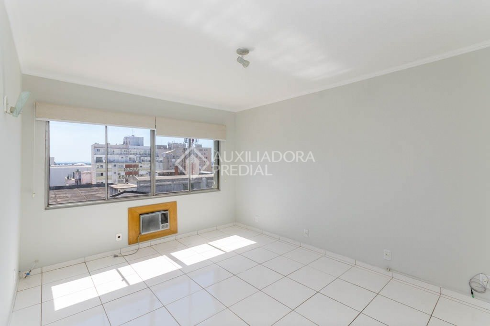 · [Ver anúncio](https://www.auxiliadorapredial.com.br/imovel/aluguel/283896)

| Campo | Valor |
|-------|-------|
| Endereço | [Av. Independência, Centro Histórico](https://www.google.com/maps?q=Av+Independencia,+Centro+Historico,+Porto+Alegre) |
| Aluguel | R$ 1.926 |
| Total | R$ 3.013 |
| Área | 77 m² |
| Quartos/Banheiros/Suítes | 2 / 2 / 1 |
| IPTU | R$ 162 | Condomínio | R$ 925 |
| **Diferencial** | Suíte; banheiro com hidromassagem; vista panorâmica; gás central; churrasqueira |

---

### 16º — [482419](https://www.auxiliadorapredial.com.br/imovel/aluguel/482419) | Centro Histórico

**[🗺️ Ver no Google Maps Street View](https://www.google.com/maps?q=Rua+Coronel+Genuino,+Centro+Historico,+Porto+Alegre)**

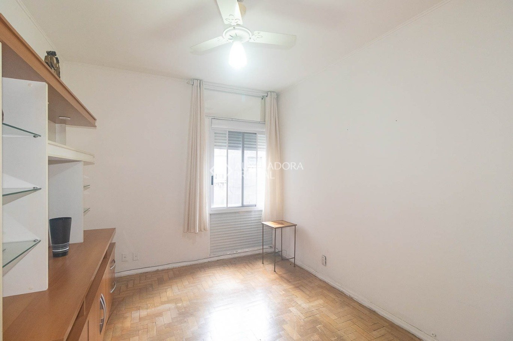 · [Ver anúncio](https://www.auxiliadorapredial.com.br/imovel/aluguel/482419)

| Campo | Valor |
|-------|-------|
| Endereço | [Rua Coronel Genuíno, Centro Histórico](https://www.google.com/maps?q=Rua+Coronel+Genuino,+Centro+Historico,+Porto+Alegre) |
| Aluguel | R$ 2.200 |
| Total | R$ 3.110 |
| Área | 76 m² |
| Quartos/Banheiros | 2 / 1 |
| IPTU | R$ 110 | Condomínio | R$ 800 |
| **Diferencial** | Mobiliado; cozinha ampla; agendamento digital |

---

### 17º — [774911](https://www.auxiliadorapredial.com.br/imovel/aluguel/774911) | Menino Deus

**[🗺️ Ver no Google Maps Street View](https://www.google.com/maps?q=Rua+Botafogo,+Menino+Deus,+Porto+Alegre)**

*Sem imagem disponível* · [Ver anúncio](https://www.auxiliadorapredial.com.br/imovel/aluguel/774911)

| Campo | Valor |
|-------|-------|
| Endereço | [Rua Botafogo, Menino Deus](https://www.google.com/maps?q=Rua+Botafogo,+Menino+Deus,+Porto+Alegre) |
| Aluguel | R$ 2.200 |
| Total | R$ 3.061 |
| Área | 80 m² |
| Quartos/Banheiros | 2 / 1 |
| IPTU | R$ 160 | Condomínio | R$ 701 |
| **Diferencial** | Living com ar-condicionado; próximo Zaffari, Parque Marinha; banheiro com bidê |

---

### 18º — [413397](https://www.auxiliadorapredial.com.br/imovel/aluguel/413397) | Menino Deus

**[🗺️ Ver no Google Maps Street View](https://www.google.com/maps?q=Rua+Barao+de+Teffe,+Menino+Deus,+Porto+Alegre)**

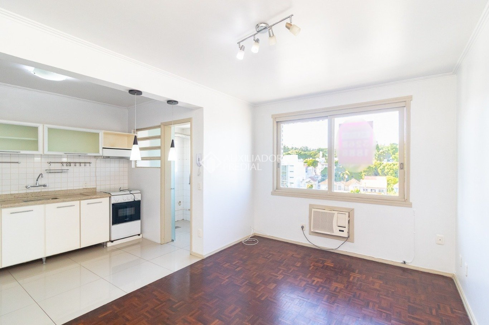 · [Ver anúncio](https://www.auxiliadorapredial.com.br/imovel/aluguel/413397)

| Campo | Valor |
|-------|-------|
| Endereço | [Rua Barão de Teffe, Menino Deus](https://www.google.com/maps?q=Rua+Barao+de+Teffe,+Menino+Deus,+Porto+Alegre) |
| Aluguel | R$ 2.000 |
| Total | R$ 3.062 |
| Área | 60 m² |
| Quartos/Banheiros | 2 / 1 |
| IPTU | R$ 62 | Condomínio | R$ 1.000 |
| **Diferencial** | Mobiliado; churrasqueira; quiosque; Orla Guaíba; Hospital Mãe de Deus |

---

### 19º — [781919](https://www.auxiliadorapredial.com.br/imovel/aluguel/781919) | Menino Deus

**[🗺️ Ver no Google Maps Street View](https://www.google.com/maps?q=Rua+Uruguaiana,+Menino+Deus,+Porto+Alegre)**

*Sem imagem disponível* · [Ver anúncio](https://www.auxiliadorapredial.com.br/imovel/aluguel/781919)

| Campo | Valor |
|-------|-------|
| Endereço | [Rua Uruguaiana, Menino Deus](https://www.google.com/maps?q=Rua+Uruguaiana,+Menino+Deus,+Porto+Alegre) |
| Aluguel | R$ 2.150 |
| Total | R$ 2.650 |
| Área | 65 m² |
| Quartos/Banheiros | 2 / 2 |
| IPTU | R$ 80 | Condomínio | R$ 420 |
| **Diferencial** | 2 banheiros; condomínio acessível; anúncio novo |

---

### 20º — [414697](https://www.auxiliadorapredial.com.br/imovel/aluguel/414697) | Centro Histórico

**[🗺️ Ver no Google Maps Street View](https://www.google.com/maps?q=Rua+Jerônimo+Coelho,+Centro+Historico,+Porto+Alegre)**

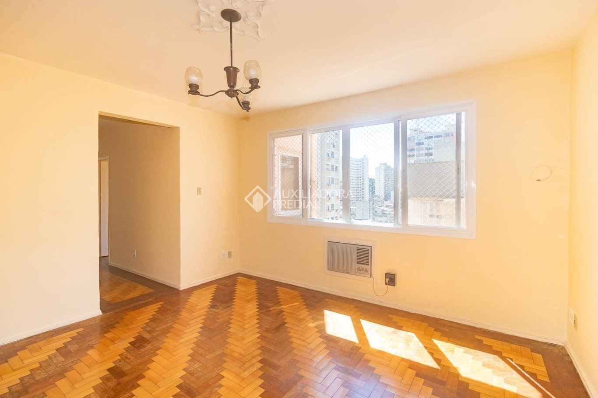 · [Ver anúncio](https://www.auxiliadorapredial.com.br/imovel/aluguel/414697)

| Campo | Valor |
|-------|-------|
| Endereço | [Rua Jerônimo Coelho, Centro Histórico](https://www.google.com/maps?q=Rua+Jerônimo+Coelho,+Centro+Historico,+Porto+Alegre) |
| Aluguel | R$ 2.350 |
| Total | R$ 3.427 |
| Área | 180 m² |
| Quartos/Banheiros | 3 / 1 |
| IPTU | R$ 127 | Condomínio | R$ 950 |
| **Diferencial** | Maior área; living amplo; posição solar norte/leste; semi-mobiliado |

---

### 21º — [781392](https://www.auxiliadorapredial.com.br/imovel/aluguel/781392) | Farroupilha

**[🗺️ Ver no Google Maps Street View](https://www.google.com/maps?q=Av+Joao+Pessoa,+Farroupilha,+Porto+Alegre)**

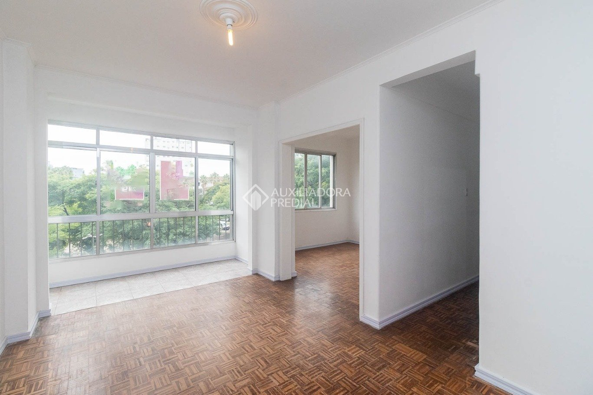 · [Ver anúncio](https://www.auxiliadorapredial.com.br/imovel/aluguel/781392)

| Campo | Valor |
|-------|-------|
| Endereço | [Av. João Pessoa, Farroupilha](https://www.google.com/maps?q=Av+Joao+Pessoa,+Farroupilha,+Porto+Alegre) |
| Aluguel | R$ 2.600 |
| Total | R$ 3.590 |
| Área | 86 m² |
| Quartos/Banheiros | 2 / 2 |
| IPTU | R$ 110 | Condomínio | R$ 880 |
| **Diferencial** | Av. João Pessoa; 2 banheiros; anúncio novo (fotos em preparação) |

---

## 4. Avaliação comparativa

### 4.1. Por custo-benefício (R$ por m² — total mensal)

| Posição | Ref | Total/m² | Total | Área |
|---------|-----|----------|-------|------|
| 1 | 288435 | R$ 24,46 | R$ 2.201 | 90 m² |
| 2 | 233858 | R$ 30,72 | R$ 2.120 | 69 m² |
| 3 | 780137 | R$ 26,67 | R$ 2.080 | 78 m² |
| 4 | 713219 | R$ 40,28 | R$ 2.417 | 60 m² |
| 5 | 778979 | R$ 35,33 | R$ 2.826 | 80 m² |

**Pior relação:** 414697 (R$ 19,04/m² — área muito grande) e 781392 (R$ 41,74/m² — menor área pelo preço).

### 4.2. Por perfil de morador

| Perfil | Recomendação | Imóveis |
|--------|--------------|---------|
| **Solteiro/a, orçamento curto** | 780137, 233858, 324467 | Baixo total, 1 quarto ou compacto |
| **Casal** | 301265, 482419, 368518 | Mobiliados, 2 quartos |
| **Família (3 quartos)** | 778979, 288435, 713219, 778856 | Espaço e preço |
| **Quem busca conforto** | 283896, 383167, 414697 | Suíte, vista, área maior |
| **Sem carro** | Todos exceto 383167, 778856, 780137 | Maioria sem vaga |

### 4.3. Por bairro

| Bairro | Qtd | Faixa total | Característica |
|--------|-----|-------------|----------------|
| Centro Histórico | 11 | R$ 2.120 — R$ 3.427 | Concentração, comércio, transporte |
| Menino Deus | 7 | R$ 2.080 — R$ 3.590 | Valorizado, orla, shoppings |
| Cidade Baixa | 2 | R$ 2.826 — R$ 3.163 | Vida noturna, Redenção |
| Rio Branco | 2 | R$ 2.201 — R$ 2.660 | Boa relação preço/área |
| Farroupilha | 1 | R$ 3.590 | Av. João Pessoa |

### 4.4. Amenidades

| Amenidade | Quantidade | Imóveis |
|-----------|------------|---------|
| Mobiliado/Semi | 8 | 301265, 482419, 413397, 399585, 414697, 713219, 324467, 235724 |
| Vaga de garagem | 4 | 383167, 778856, 780137 |
| Suíte | 2 | 383167, 283896 |
| Churrasqueira | 5 | 283896, 324467, 413397, 713219, 235724 |
| Ar-condicionado/Split | 4 | 383167, 399585, 413397, 774911 |

---

## 5. Conclusão e recomendações

**Top 3 para considerar primeiro:**

1. **778979** — Promoção forte, Cidade Baixa, 3 quartos, portaria 24h.  
2. **288435** — Melhor custo-benefício, 90 m², condomínio R$ 1.  
3. **233858** — Menor custo total, Centro Histórico, bom sol.

**Para quem prioriza economia:** 233858, 780137, 713219  
**Para quem precisa de espaço:** 414697 (180 m²), 399585 (99 m²), 235724 (97 m²)  
**Para quem quer praticidade:** 301265, 482419 (mobiliados e agendamento digital)

---

*Relatório gerado em 16/03/2025. Dados sujeitos a alteração; verificar disponibilidade nos sites das imobiliárias.*
